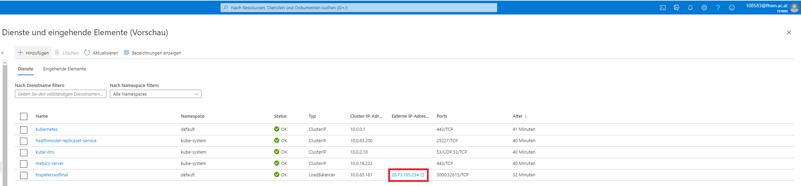

Dokumentation Übung Peter Vadle & Matthias Mandl

Link Git Repo:
https://github.com/BisPeter/SWD_Final

Link zu dem Docker image in der registry:
swdfinalreg.azurecr.io/bispeterswdfinal:129

Links zu denm Public endpoint von AKS wo die Applikation läuft:
http://20.73.105.234:3000/

Schritte:
Zuerst muss ein Container Registry und ein Cubernetes Service in Azure erstellt werden

Nun muss ein Dockerfile erstellt werden. 
Am Ende wird das Dockerfile auf Port 3000 exposed.
durch CMD ["node", "index.js"] wird unsere applikation ausgeführt.

Nun muss eine Azure Pipeline erstellt werden.
Hierbei wird im Configure-Schritt "Deploy to Azure Kubernetes Service" ausgewählt. => Daraus wird das yaml File erstellt

Erfolgreiche Pipeline-Durchlauf:

Nun kann die IP aus dem Azure Kubernetes Service herausgelesen werden und unter folgender IP Addresse besucht werden:
http://20.73.105.234:3000/

Kubernetes Service:
